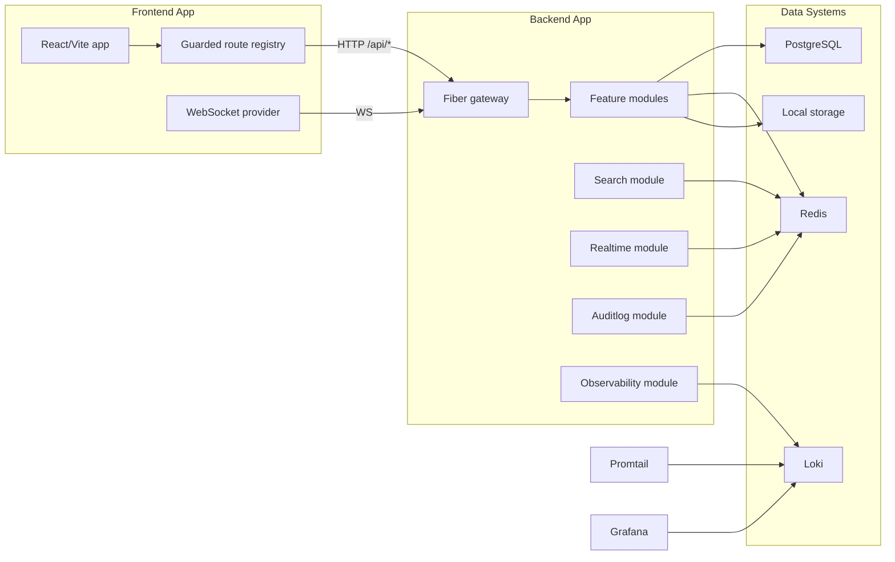
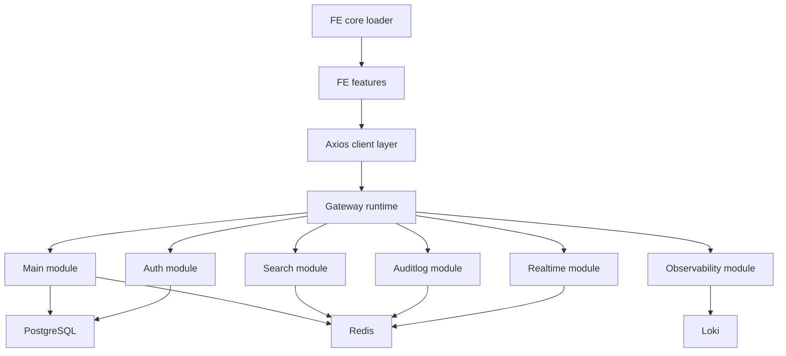
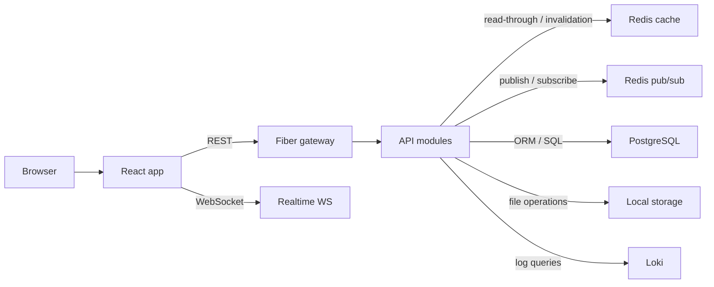

# Project Tech Stack Inventory

## 1. Overview

This repository contains two confirmed runtime applications:

- `fe/`: a React + TypeScript admin frontend built with Vite.
- `api/`: a Go backend composed from gateway-launched modules under `api/modules/*`.

The backend boot path in `api/main.go` initializes config, logging, PostgreSQL connectivity, Ent, SQL migrations, Redis, circuit breakers, cron jobs, and the Fiber gateway. The gateway runtime in `api/gateway/runtime/start.go` generates a module registry from `api/modules/*/config.yaml`, starts modules through the module runner, and reverse-proxies external module routes.

The frontend auto-loads feature modules from `fe/src/features/**/index.tsx` through `fe/src/core/index.ts`, builds permission-guarded routes in `fe/src/app/routes.tsx`, uses shared Axios clients under `fe/src/core/network/*`, and mounts a WebSocket provider in `fe/src/app/app.tsx`.

## 2. Tech Stack Table

| Category | Technology | Version | Evidence | Purpose | Status |
| --- | --- | --- | --- | --- | --- |
| Backend | Go | 1.24.1 | `api/go.mod`, `api/Dockerfile`, `api/Dockerfile.prod` | Backend language/runtime | Active |
| Backend | Fiber | v2.52.8 | `api/go.mod`, `api/main.go`, `api/gateway/main.go` | HTTP server and gateway composition | Active |
| Backend | `gofiber/websocket` | v2.2.1 | `api/go.mod`, `api/modules/realtime/handler/websocket_handler.go` | WebSocket handler transport | Active |
| Backend | `gorilla/websocket` | v1.5.3 | `api/go.mod`, `api/gateway/proxy/ws_proxy.go` | Gateway WebSocket proxying | Active |
| Backend | JWT (`golang-jwt/jwt/v5`) | v5.3.0 | `api/go.mod`, `api/shared/utils/jwtutil.go`, `api/shared/middleware/auth.go` | Token signing/parsing and auth middleware | Active |
| Backend | Ent | v0.14.4 | `api/go.mod`, `api/main.go`, `api/shared/db/ent/generate.go`, `api/shared/gen/tasks.go` | ORM and schema/code generation | Active |
| Backend | Viper | v1.20.1 | `api/go.mod`, `api/shared/config/init.go`, `api/shared/cron/cron_manager.go` | YAML/env-backed configuration | Active |
| Backend | Zap | v1.27.0 | `api/go.mod`, `api/shared/logger/logger.go` | Structured JSON logging | Active |
| Backend | `sony/gobreaker` | v1.0.0 | `api/go.mod`, `api/shared/circuitbreaker/cb.go`, `api/shared/app/http_client.go` | Circuit breaker for internal HTTP calls | Active |
| Backend | `robfig/cron/v3` | v3.0.1 | `api/go.mod`, `api/main.go`, `api/shared/cron/cron_manager.go` | Scheduled jobs | Active |
| Frontend | React | 19.1.1 | `fe/package.json`, `fe/src/main.tsx` | Frontend rendering | Active |
| Frontend | TypeScript | 5.9.3 | `fe/package.json`, `fe/tsconfig.json` | Typed frontend code | Active |
| Frontend | Vite | 7.1.7 | `fe/package.json`, `fe/vite.config.ts` | Dev server and build tool | Active |
| Frontend | `@vitejs/plugin-react-swc` | 4.1.0 | `fe/package.json`, `fe/vite.config.ts` | React transform plugin | Active |
| Frontend | React Router DOM | 7.9.4 | `fe/package.json`, `fe/src/app/routes.tsx` | Browser routing | Active |
| Frontend | Zustand | 5.0.8 | `fe/package.json`, `fe/src/store/auth-store.ts` | Client auth/session state | Active |
| Frontend | Axios | 1.13.1 | `fe/package.json`, `fe/src/core/network/axios-client.ts`, `fe/src/core/network/api-client.ts` | Shared HTTP client layer | Active |
| Frontend | Material UI | 7.3.4 | `fe/package.json`, `fe/src/main.tsx`, `fe/src/app/theme.ts` | UI component system | Active |
| Frontend | MUI X Data Grid | 8.27.0 | `fe/package.json`, `fe/src/core/table` | Table/grid infrastructure | Active |
| Frontend | MUI X Date Pickers | 8.16.0 | `fe/package.json`, `fe/src/app/app.tsx` | Date/time input components | Active |
| Frontend | Day.js | 1.11.19 | `fe/package.json`, `fe/src/app/app.tsx` | Date adapter for UI | Active |
| Frontend | `react-hot-toast` | 2.6.0 | `fe/package.json`, `fe/src/app/app.tsx` | Toast notifications | Active |
| Frontend | Recharts | 3.7.0 | `fe/package.json`, `fe/src/features/observability_logs/components/system-log-summary-cards.tsx` | Charting in observability UI | Active |
| Frontend | `@dnd-kit/core` / `@dnd-kit/sortable` | 6.3.1 / 10.0.0 | `fe/package.json`, `fe/src/shared/components/status-board`, `fe/src/core/table/edit-table.tsx` | Drag-and-drop interactions | Active |
| Data | PostgreSQL | `postgres:16-alpine` image | `api/docker-compose.yml`, `api/docker-compose.prod.yml`, `api/shared/db/driver/postgres.go` | Primary relational database | Active |
| Data | Redis | `redis:7-alpine` image, client v9.12.1 | `api/docker-compose.yml`, `api/go.mod`, `api/config.yaml`, `api/shared/redis/manager.go` | Cache, pub/sub, and status instances | Active |
| Data | Redis Pub/Sub | Not confirmed separately | `api/shared/pubsub/pubsub.go`, `api/modules/search/service/service.go`, `api/modules/realtime/service/pubsub.go`, `api/modules/auditlog/service/pubsub.go` | Cross-module async messaging | Active |
| Data | App-managed SQL migrations | Not confirmed separately | `api/shared/bootstrap/sql_migrations.go`, `api/migrations/sql/V1__baseline.sql`, `api/shared/gen/tasks.go` | Versioned SQL migrations at boot time | Active |
| Data | MongoDB driver | v1.17.4 | `api/go.mod`, `api/config.yaml`, `api/shared/db/factory.go`, `api/shared/db/driver/mongodb.go` | Optional database provider path | Configured |
| Data | Filesystem-backed storage | Not confirmed separately | `api/docker-compose.prod.yml`, `api/modules/photo/service/photo_file.go`, `api/shared/storage/local_storage.go` | Local file storage for photo/files | Active |
| Infra | Docker | Not confirmed separately | `api/Dockerfile`, `api/Dockerfile.prod`, `api/docker/entrypoint.dev.sh`, `api/docker/entrypoint.prod.sh` | Backend containerization | Active |
| Infra | Docker Compose | Not confirmed separately | `api/docker-compose.yml`, `api/docker-compose.prod.yml`, `api/docker-compose.observability.yml`, `api/Makefile` | Local and production-like orchestration | Active |
| Infra | Loki | `grafana/loki:2.9.8` | `api/docker-compose.observability.yml`, `api/observability/loki-config.yaml`, `api/modules/observability/repository/loki_repository.go` | Log storage/query backend | Configured |
| Infra | Promtail | `grafana/promtail:2.9.8` | `api/docker-compose.observability.yml`, `api/observability/promtail-config.yaml` | Log shipping into Loki | Configured |
| Infra | Grafana | `grafana/grafana:11.1.5` | `api/docker-compose.observability.yml`, `api/observability/grafana/provisioning/datasources/loki.yaml` | Log exploration UI | Configured |
| Infra | GNU Make | Not confirmed separately | `api/Makefile` | Local ops wrapper for compose, migrations, observability | Active |
| Infra | Drone CI | Not confirmed | `api/CICD.md` | CI flow documented only | Legacy |
| Infra | Firebase deployment | Not confirmed | `api/CICD.md` | Deployment flow documented only | Legacy |
| Tooling | ESLint | 9.36.0 | `fe/package.json`, `fe/eslint.config.js` | Frontend linting | Active |
| Tooling | `typescript-eslint` | 8.45.0 | `fe/package.json`, `fe/eslint.config.js` | Type-aware lint rules | Active |
| Tooling | Bun | Not confirmed separately | `fe/package.json`, `fe/bun.lock` | Frontend scaffolding command runner | Configured |
| Tooling | Ent code generation | Not confirmed separately | `api/shared/gen/tasks.go`, `api/scripts/gen/main.go`, `api/shared/db/ent/generate.go` | ORM code generation workflow | Active |
| Tooling | Atlas | v0.36.1 (indirect) | `api/go.mod` | Ent ecosystem dependency | Configured |
| Tooling | Custom Go CLIs | Not confirmed separately | `api/scripts/create_module/main.go`, `api/scripts/create_dept_module/main.go`, `api/scripts/module_runner/main.go`, `api/scripts/status_monitor/main.go` | Scaffolding and local backend operations | Active |

## 3. Architecture Diagram

## 4. Backend Stack

- Runtime and boot: `api/main.go` loads env/config, configures logging, initializes the DB client, bootstraps Ent, applies SQL migrations, seeds roles/permissions, initializes Redis, circuit breakers, workers, and crons, then starts the gateway.
- Composition: `api/gateway/runtime/start.go` generates runtime metadata from `api/modules/*`, starts modules through `api/scripts/module_runner/runner`, and reverse-proxies external module routes through Fiber.
- Confirmed module set: `attribute`, `auditlog`, `auth`, `folder`, `main`, `metadata`, `notification`, `observability`, `photo`, `profile`, `rbac`, `realtime`, `search`, `token`, and `user`.
- Auth and permissions: JWT helpers are in `api/shared/utils/jwtutil.go`, request auth middleware is in `api/shared/middleware/auth.go`, and RBAC middleware is in `api/shared/middleware/rbac/rbac.go`.
- Resilience: `api/shared/app/http_client.go` wraps internal module-to-module HTTP calls with retry logic and `api/shared/circuitbreaker/cb.go`.

## 5. Frontend Stack

- The frontend boot path is `fe/src/main.tsx`, which mounts the MUI theme and imports `fe/src/core/index.ts`.
- `fe/src/core/index.ts` auto-loads feature registrars, schemas, tables, widgets, and core modules through `import.meta.glob(...)`.
- `fe/src/app/routes.tsx` builds the active router with `createBrowserRouter(...)` and wraps protected pages in `RequireAuth`.
- Shared networking is Axios-based. The repo currently contains two client implementations: `fe/src/core/network/axios-client.ts` and `fe/src/core/network/api-client.ts`.
- Auth/session state is in `fe/src/store/auth-store.ts` using Zustand persistence middleware.
- Realtime is mounted in `fe/src/app/app.tsx` and implemented in `fe/src/core/network/websocket/ws-client.ts`.

## 6. Data Layer

- PostgreSQL is the only confirmed active primary database. It is provisioned in both Compose files and used by the Go PostgreSQL driver path.
- SQL migrations are applied in-process through `api/shared/bootstrap/sql_migrations.go`.
- Redis is active and multi-instance. `api/config.yaml` defines `cache`, `pubsub`, and `status` instances, and `api/shared/redis/manager.go` initializes named clients.
- Redis pub/sub is actively consumed by at least the search, auditlog, and realtime modules.
- MongoDB support exists in code and config, but no active provisioning or module runtime evidence confirms it as a deployed path.
- The photo/storage path is filesystem-backed. No S3-compatible or external object storage integration was confirmed.
- No vector database was confirmed.

## 7. Infrastructure & DevOps

- Backend containers are built from `golang:1.24.1-bookworm` in both `api/Dockerfile` and `api/Dockerfile.prod`.
- Compose is the confirmed infrastructure entrypoint for local and production-like environments: `api/docker-compose.yml`, `api/docker-compose.prod.yml`, and `api/docker-compose.observability.yml`.
- The optional observability stack provisions Loki, Promtail, and Grafana locally.
- `api/Makefile` wraps compose startup, observability startup, migrations, and Redis flush operations.
- No Nginx configuration was found.
- No repo-resident CI pipeline manifest was found. `api/CICD.md` documents Drone/Firebase flows only.
- TLS termination/certificate automation was not confirmed.

## 8. Observability & Tooling

- Logging is implemented with Zap and configured as JSON output in `api/shared/logger/logger.go`.
- The observability module queries Loki through `api/modules/observability/repository/loki_repository.go`.
- Promtail is configured to ship local log files into Loki, and Grafana is provisioned with a Loki datasource.
- Ent generation and migration helpers are exposed through `api/scripts/gen/main.go` and `api/shared/gen/tasks.go`.
- The repo includes custom scaffolding and local-ops CLIs under `api/scripts/*` and `fe/scripts/create-module`.
- Frontend linting is configured through ESLint and `typescript-eslint`.

## 9. Module Interaction Diagram

## 10. Data Flow Diagram

## 11. Module Mapping

| Module / Area | Stack Usage |
| --- | --- |
| `api/gateway` | Fiber gateway, runtime registry generation, module startup, reverse proxy, WebSocket proxy |
| `api/modules/main` | Core backend module, PostgreSQL via Ent, Redis cache/pubsub integration |
| `api/modules/auth` | JWT-authenticated Fiber handlers and middleware-backed auth flows |
| `api/modules/token` | Token lifecycle and cron-based cleanup |
| `api/modules/rbac` | Role/permission management with shared RBAC middleware |
| `api/modules/realtime` | WebSocket endpoints plus Redis pub/sub fan-out |
| `api/modules/search` | Search/event subscribers via Redis pub/sub |
| `api/modules/auditlog` | Audit persistence and async `log:create` subscriber |
| `api/modules/observability` | Loki-backed log query API |
| `api/modules/photo` | Filesystem-backed file handling plus metadata persistence |
| `fe/src/core` | Registry, network, auth guards, table/form infrastructure, WebSocket provider |
| `fe/src/features/auth` | Login/account UI using shared auth/network modules |
| `fe/src/features/staff` | Staff CRUD/search UI using shared tables/forms/network |
| `fe/src/features/department` | Department management UI |
| `fe/src/features/rbac` | Role/matrix permission UI |
| `fe/src/features/metadata` | Metadata collection/import UI |
| `fe/src/features/notification` | Notification UI |
| `fe/src/features/observability_logs` | System log UI over backend observability endpoints |

## 12. Risks / Inconsistencies

- `fe/src/routes/router.tsx` exists alongside the active router in `fe/src/app/routes.tsx`, which suggests a parallel or stale routing path.
- The frontend networking layer is duplicated across `fe/src/core/network/axios-client.ts` and `fe/src/core/network/api-client.ts`.
- `README.md` and `api/README.md` still mention Flyway-style migration history, while runtime migration execution is implemented in `api/shared/bootstrap/sql_migrations.go`.
- `fe/README.md` references React 18, but `fe/package.json` pins React 19.1.1.
- MongoDB support is present in code/config, but active deployment evidence was not found.
- Drone/Firebase deployment is documented in `api/CICD.md`, but no executable pipeline/config manifests were found.
- Observability infrastructure is configured locally, but always-on production deployment was not confirmed.

## 13. Evidence Appendix

Primary manifests and config:

- `api/go.mod`
- `api/config.yaml`
- `api/Dockerfile`
- `api/Dockerfile.prod`
- `api/docker-compose.yml`
- `api/docker-compose.prod.yml`
- `api/docker-compose.observability.yml`
- `api/Makefile`
- `api/CICD.md`
- `api/README.md`
- `api/README_DOCKER.md`
- `api/OBSERVABILITY_LOCAL.md`
- `fe/package.json`
- `fe/tsconfig.json`
- `fe/eslint.config.js`
- `fe/vite.config.ts`
- `fe/README.md`
- `fe/bun.lock`

Backend runtime, data, and shared platform:

- `api/main.go`
- `api/gateway/main.go`
- `api/gateway/runtime/start.go`
- `api/gateway/proxy/ws_proxy.go`
- `api/shared/config/init.go`
- `api/shared/logger/logger.go`
- `api/shared/app/http_client.go`
- `api/shared/circuitbreaker/cb.go`
- `api/shared/cron/cron_manager.go`
- `api/shared/db/factory.go`
- `api/shared/db/driver/postgres.go`
- `api/shared/db/driver/mongodb.go`
- `api/shared/db/ent/generate.go`
- `api/shared/gen/tasks.go`
- `api/shared/bootstrap/sql_migrations.go`
- `api/shared/redis/manager.go`
- `api/shared/cache/cache.go`
- `api/shared/pubsub/pubsub.go`
- `api/shared/storage/local_storage.go`
- `api/shared/middleware/auth.go`
- `api/shared/middleware/rbac/rbac.go`
- `api/shared/utils/jwtutil.go`

Module evidence:

- `api/modules/attribute/config.yaml`
- `api/modules/auditlog/config.yaml`
- `api/modules/auditlog/service/pubsub.go`
- `api/modules/auth/config.yaml`
- `api/modules/folder/config.yaml`
- `api/modules/main/config.yaml`
- `api/modules/metadata/config.yaml`
- `api/modules/notification/config.yaml`
- `api/modules/observability/config.yaml`
- `api/modules/observability/repository/loki_repository.go`
- `api/modules/photo/config.yaml`
- `api/modules/photo/service/photo_file.go`
- `api/modules/profile/config.yaml`
- `api/modules/rbac/config.yaml`
- `api/modules/realtime/config.yaml`
- `api/modules/realtime/service/pubsub.go`
- `api/modules/realtime/handler/websocket_handler.go`
- `api/modules/search/config.yaml`
- `api/modules/search/service/service.go`
- `api/modules/token/config.yaml`
- `api/modules/user/config.yaml`

Frontend runtime and features:

- `fe/src/main.tsx`
- `fe/src/app/app.tsx`
- `fe/src/app/routes.tsx`
- `fe/src/app/theme.ts`
- `fe/src/core/index.ts`
- `fe/src/core/auth/require-auth.tsx`
- `fe/src/core/network/axios-client.ts`
- `fe/src/core/network/api-client.ts`
- `fe/src/core/network/websocket/ws-client.ts`
- `fe/src/store/auth-store.ts`
- `fe/src/features/auth/index.tsx`
- `fe/src/features/department/index.tsx`
- `fe/src/features/metadata/index.tsx`
- `fe/src/features/notification/index.tsx`
- `fe/src/features/observability_logs/index.tsx`
- `fe/src/features/observability_logs/components/system-log-summary-cards.tsx`
- `fe/src/features/rbac/index.tsx`
- `fe/src/features/search/index.tsx`
- `fe/src/features/settings/index.tsx`
- `fe/src/features/staff/index.tsx`
